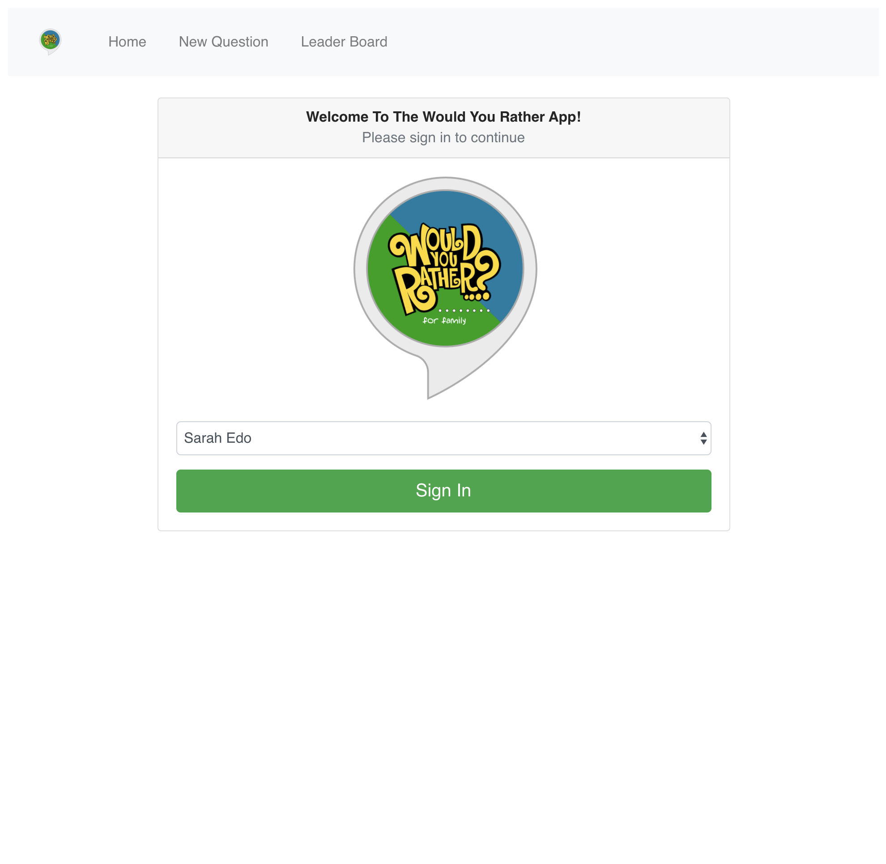
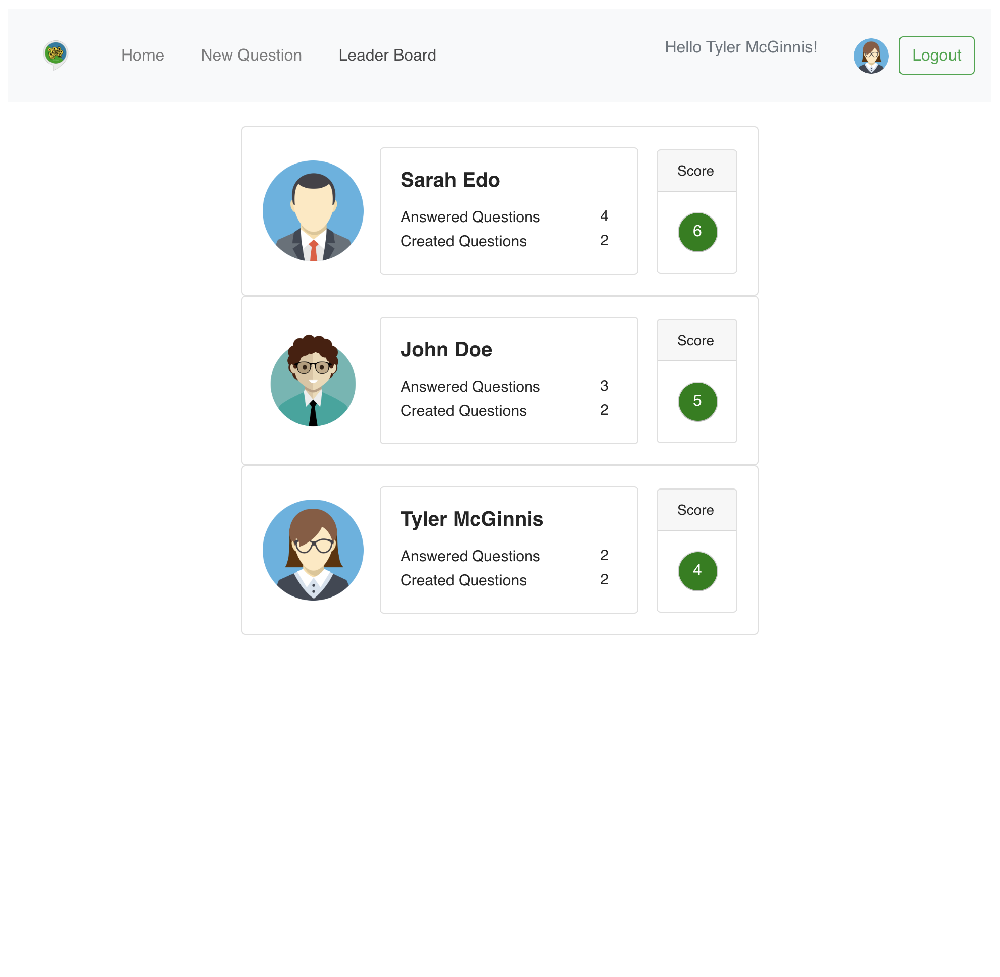
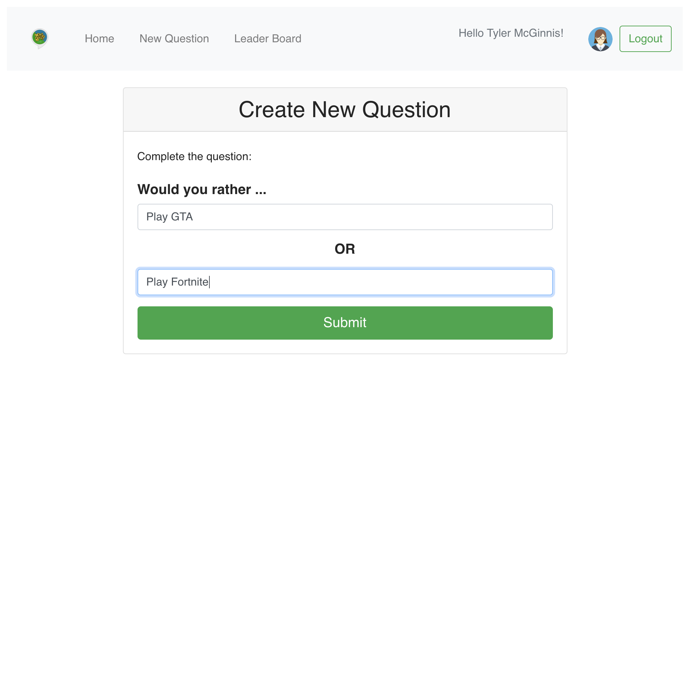
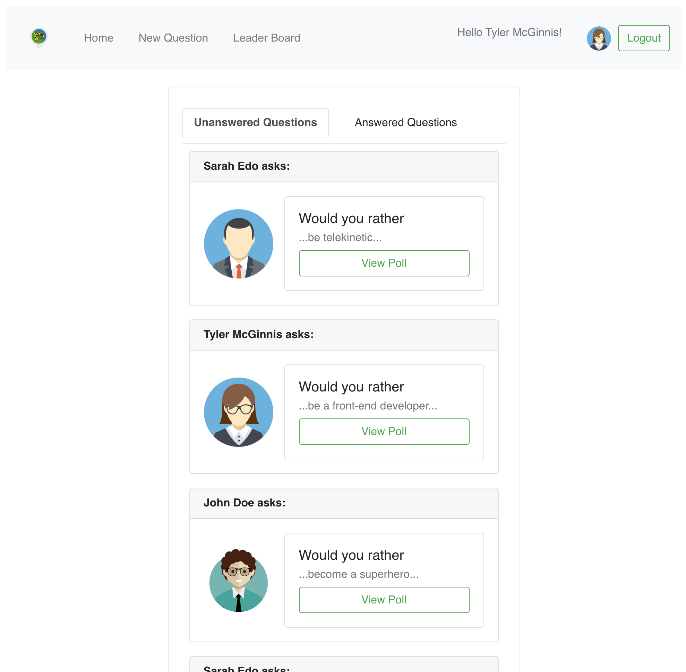

# would-you-rather

This fun app allows users to create questions in the form: “Would you rather [option A] or [option B] ?”. Answering "neither" or "both" is against the rules. Users will be able to answer questions, see which questions they haven’t answered, see how other people have voted, post questions, and see the ranking of users on the leaderboard.

## Technology Used

This app is developed using `React`, `Redux`, `JavaScript`, `JSX` and `BootStrap`.

## Run

To run the app:

* install all project dependencies with `npm install`
* start the development server with `npm start`

## API

The app uses a mock API provided in the file `_DATA.js`.

## Screenshots

